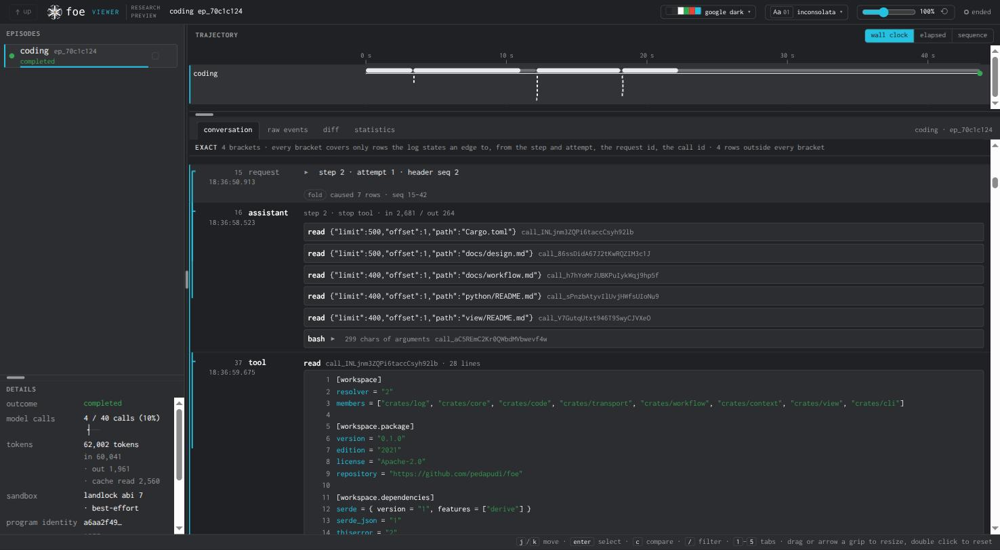

# Options weighed for reading a run

A historical record. It states what was considered before the viewer's
unified outline was built, what each option cost when it was measured, and
which one shipped. It is not a specification: `viewer.md` describes the
viewer as it exists, and where the two disagree `viewer.md` is right.

## What was being decided

A run's log holds four kinds of thing that stand in a hierarchy: an
episode, the steps it took, the tool calls each step issued, and the
messages and results those produced. The viewer as it stood drew that
hierarchy three separate times: as a tree of episodes in a rail down the
left, as a timeline of marks across the top, and as a flat list of
messages in the middle. A reader moving between the three rebuilt the
correspondence by eye each time.

Two questions had to be settled: how a transcript should show the
structure under it, and how one tool call should be drawn in a figure of
lanes and curves.

## The measurement that framed the first question

A recorded coding run over this repository, one episode of 1,255 events
stored under `.foe/ep_70c1c124`, was folded into the rows the conversation
pane renders. Two quantities were counted: the characters of text the
model itself wrote, and the characters of output the tools returned.

| what the pane sets | characters |
|---|---|
| what the model said, over four steps | 5,719 |
| what the tools returned, over thirteen results | 139,281 |

Tool output is 96 percent of the character mass — 139,281 of 145,000. A
transcript that sets every result in full is therefore a document about
tool output with the model's reasoning scattered through it. Any layout
that leaves results expanded by default inherits that ratio, and no
arrangement of the remaining 4 percent compensates.

That ratio is why the shipped outline puts what the model said and what
its tools returned on separate rungs. Measured over the same run, one rung
apart:

| reading | rows | characters |
|---|---|---|
| the structure and what the model said | 19 | 5,974 |
| the same, plus what the tools returned | 32 | 145,255 |

Thirteen more rows carry 139,281 more characters. A result row averages
10,714 characters where every other kind of row averages 314, so a result
row is worth about thirty-four of anything else. Counting rows would have
put those thirteen at 41 percent of the page and hidden the fact that they
are 96 percent of it.

The full ladder over the same run, each rung named for the class of row it
adds:

| rung | rows | characters |
|---|---|---|
| episodes | 1 | 17 |
| steps | 5 | 81 |
| calls | 18 | 255 |
| conversation | 19 | 5,974 |
| outputs | 32 | 145,255 |

Five rows and 81 characters describe what a 1,255-event run did. Adding
the model's own words costs 14 rows and 5,893 characters. Adding the tool
output costs 13 rows and 139,281.

The same shape holds over every fixture in the repository, at their own
scale. Each cell gives rows and then characters.

| fixture | episodes | steps | calls | conversation | outputs |
|---|---|---|---|---|---|
| `child` | 1 / 14 | 3 / 38 | 4 / 38 | 5 / 59 | 6 / 99 |
| `compact` | 1 / 23 | 5 / 93 | 8 / 93 | 12 / 142 | 15 / 216 |
| `fork` | 1 / 15 | 3 / 76 | 5 / 76 | 7 / 134 | 9 / 259 |
| `overlap-child` | 1 / 21 | 3 / 45 | 4 / 45 | 5 / 58 | 6 / 75 |
| `overlap-parent` | 1 / 18 | 4 / 76 | 7 / 85 | 10 / 149 | 13 / 224 |
| `retries-exhausted` | 1 / 17 | 2 / 32 | 2 / 32 | 2 / 32 | 2 / 32 |
| `rich` | 1 / 13 | 3 / 54 | 5 / 69 | 7 / 1,029 | 9 / 1,501 |
| `root` | 1 / 15 | 5 / 88 | 8 / 105 | 12 / 207 | 15 / 370 |
| `workflow` | 1 / 31 | 7 / 89 | 8 / 89 | 8 / 89 | 9 / 97 |
| `workflow-apply-1` | 1 / 16 | 3 / 55 | 4 / 55 | 5 / 144 | 6 / 594 |
| `workflow-propose-1` | 1 / 18 | 2 / 30 | 3 / 30 | 4 / 86 | 5 / 95 |
| `workflow-propose-2` | 1 / 18 | 2 / 30 | 3 / 30 | 4 / 86 | 5 / 95 |

Folded into the runs a reader actually opens:

| run | episodes | steps | calls | conversation | outputs |
|---|---|---|---|---|---|
| root and its child and fork | 3 / 44 | 11 / 202 | 17 / 219 | 24 / 400 | 30 / 728 |
| a workflow and its three children | 4 / 83 | 14 / 204 | 18 / 204 | 21 / 405 | 25 / 881 |
| a lead and its two children | 3 / 52 | 10 / 175 | 16 / 199 | 22 / 1,236 | 28 / 1,800 |
| every fixture at once | 12 / 219 | 42 / 706 | 61 / 747 | 81 / 2,215 | 100 / 3,657 |

The fixtures are small enough that the last rung roughly doubles them,
where the recorded run multiplies by twenty-four. Two of them show why the
ladder is worth having even at that scale: `rich` carries a diff and a
fenced block, so its conversation rung is already 1,029 characters against
54 at the rung below, and `retries-exhausted` never received a message at
all, so all five rungs are identical.

The outline opens at the conversation rung. It is the whole causal
structure of a run and the model's own account of it, stopping one rung
short of the text that is 96 percent of the mass.

## Five ways to show structure in a transcript

### The flat list, which is where the viewer started

One row per event that contributes to the dialogue, in log order, with
every tool result set in full. Structure is not drawn at all: a reader
infers which call a result closes from adjacency, and which episode
spawned which from a note row naming an identifier.

Measured in a browser at a window width of 1,600 pixels and a page scale
of 120 percent, against the 1,255-event run: 41,133 pixels tall, 9,034
elements. One step of that run issued six calls at once; that step and its
results alone occupy 26,672 pixels.

*The six-call step in the flat list. The results run past the bottom of
the window and the step that issued them has scrolled away above.*

### Execution nested under each step

Everything a step caused hangs underneath it: the calls it issued, the
results those returned, and the child episodes those spawned, with each
child's own steps drawn inside it. A node is one line until a reader opens
it, naming the tool, its arguments cut to one line, how many lines the
result holds, how long the call took, and the call identifier.

Against the same run: 4,030 pixels and 351 elements, from 41,133 and
9,034. The six-call step falls from 26,672 pixels to 195. Placement comes
from identifiers the log wrote rather than from position or timing — a
call hangs under the step whose `assistant/message` declared its
`call_id`, and a spawned child under the call whose identifier its
`spawn/start` names.

*The same six-call step nested. Each call is one line carrying its tool,
its arguments and the size of its result.*

*Opening one result costs only that result. Opening all six returns the
step to 24,947 pixels, which is what the flat list lays out unasked.*

The cost is fidelity on a declared workflow. A workflow node writes its
own call identifier, such as `propose#1`, which no assistant message ever
declares. Of the four nodes in the workflow run measured, three name a
call identifier no step issued, so they cannot hang under a step and fall
out of the tree. The prototype reports this as a `partial` claim, names
the three, and draws them at the log position where their `spawn/start`
fell.

*A workflow run under nesting. The head of the pane states `partial` and
counts the children no step owns.*

The graph caused those children and no step did, so under this layout the
step is the wrong owner and the pane can only say so.

### A side pane holding the structure

The transcript is left as it stood and the hierarchy is drawn beside it in
a pane of its own, with selection linked between the two.

The transcript is untouched, and its cost is therefore unchanged: 41,152
pixels and 9,036 elements. Every node of a declared workflow finds its
place, because the side pane places a node by whichever identifier the log
wrote rather than requiring a step to own it. The workflow run resolves to
21 nodes with no gaps, and placement holds at scale: a synthetic run of
12,404 events resolves 4,201 nodes.

The cost is width. The pane takes 279 pixels of fixed horizontal chrome on
top of the 288 the episode rail already holds, so 567 pixels of a window
are spent before any transcript is drawn.

*The six-call step with the structure drawn beside it. The transcript
column is narrower by the width of the pane.*

*The workflow run, all 21 nodes placed. Nothing falls out, because a node
does not need a step to own it.*

### Brackets in the transcript's gutter

The transcript keeps its order and a bracket is drawn in the left gutter
spanning the rows one step caused, with a control to fold the span.

The transcript grows by 155 pixels and 1.5 percent more elements, so the
drawing is nearly free. Every node of a declared workflow finds its place,
for the same reason it does in the side pane: a bracket spans rows by log
position and needs no owner.

The cost is that folding does not reduce anything. A folded span hides its
rows without removing them, so the element count never drops and the
41,133 pixels of the flat list remain laid out behind the fold. The
measurement that framed the question is therefore untouched by this
option.

*The six-call step folded. The rows are hidden and still present.*

*Unfolded, the transcript is the flat list with a bracket beside it.*

*A workflow run. Each spawn is bracketed at the log position where it
fell, which is why no node is lost.*

### One collapsible outline at a chosen depth

The rail, the figure and the transcript are one hierarchy read at four
depths, so a single outline replaces all three and a depth control moves
between the readings. A caret on any row opens one branch one level past
the current reading.

This is what shipped. `viewer.md` specifies it.

## Deep trees and structure that is not finished

Two cases test a layout beyond a single well-formed episode: a tree of
episodes several levels deep, and a run whose structure is still open or
that failed before producing any.

Under nesting, a three-level tree opens in two clicks and stands in 484
pixels: the root step shows one line for the spawn it issued, naming the
child's program, its identifier, how it ended and what it spent, and each
click opens one more level. A fourth level is not drawn inline; the node
names the child and offers a control that selects it in the page.

*Three levels of spawned episodes without navigating away from the root
step.*

The side pane has no such limit, because its nodes are not constrained to
hang under a step: the synthetic tree it was measured against resolves 27
nodes at eight levels below its root.

*The same shape beside an unchanged transcript.*

Open and failed structure was drawn only for the nested prototype. A tool
call with no result yet keeps its line and carries the mark the trajectory
gives something not yet closed. A spawn whose child has written no log
reads `log not read`. A child that ended without ever writing one reads
its outcome, so a failed launch reads `failed` with the error its
`spawn/end` recorded, and the call above it carries the cross for a failed
result.

*A run still going. Neither the open call nor the child without a log is
guessed at.*

*A failed launch. The outcome comes from the `spawn/end` the parent
recorded.*

An episode that made no tool call and no spawn has no structure to draw at
all. The recorded run blocked after five failed attempts is such an
episode: five attempts produced five steps and no execution.

*The blocked run. The pane states that there is nothing to place rather
than drawing an empty tree.*

## Five ways to draw one tool call in a figure

Three of the five were drawn and counted, on one run whose figure holds
twelve nodes. The other two were settled by argument, and are recorded
here with that argument. The curve count given for a tick with a return
edge is arithmetic over the counted cases rather than a measurement.

| treatment | curves | lane columns | counted on the twelve-node figure |
|---|---|---|---|
| a lane per call | 14 | 3 | yes |
| a lane per step | 8 | 4 | yes |
| a tick with a return edge | 14 by arithmetic | 2 | no |
| a tick with no return edge | 2 | 2 | yes |
| a row of its own | none | 2 | no |

**A lane per call** gives every call its own column for the length of the
call, so a step that issued six calls opens six lanes and closes them
again. It costs a branch curve and a merge curve per call, which is the 14
curves counted against three columns.

**A lane per step** opens one lane per step instead, and hangs that step's
calls on it. It halves the curves to eight and adds a column, because a
step's lane stays open while its child episodes hold columns of their own.

**A tick with a return edge** draws each call as a short horizontal tick
off its lane with a merge curve back. The tick costs no curve and the
merge costs one per call. On a figure of twelve nodes holding twelve
calls, that is twelve merges added to the two curves the episode structure
already needs, so the count returns to fourteen.

**A tick with no return edge** drops the merge. The lane continuing past
the tick is the return, which is why no edge is needed: a call cannot
diverge from its caller and cannot outlive it, so a merge would draw a
fact the structure already guarantees. Two curves and two columns. This
is what the figure ships.

**A row of its own** gives the call a row in a vertical list rather than a
mark in a figure. It costs no curve and no column, and it costs one row
per call. The outline ships this at its `calls` depth and deeper; the
figure does not, because the figure's whole purpose is to show a run's
shape in less height than its rows would take.

The count of calls is what decides between these. Calls are the largest
population in the model — the 1,255-event run holds four steps and
thirteen calls, and the synthetic stress run holds 200 steps and 4,000
calls — so anything drawn once per call multiplies by the biggest number
in the system.

## Why the shipped design won

The character measurement rules out any layout that sets tool output by
default, which removes the flat list and the bracketed gutter: both leave
the 41,133 pixels laid out, one of them behind a fold. Nesting removes the
height and loses a declared workflow's children, because it requires a
step to own every node. The side pane places every node and spends 279
pixels of width to do it, on top of the rail's 288.

The unified outline takes what each of the four established. It removes
the height the way nesting does, by making a body something a reader opens
rather than something the page sets. It places every node of a declared
workflow the way the side pane does, under whichever obligation pair the
log wrote: a workflow node under its episode's graph, and a spawned child
under the call whose `spawn/start` names it. No node needs a step to own
it. It spends no fixed width, because the hierarchy is drawn in the
same column the rows occupy. And it removes the rail and the timeline as
separate regions, because collapsed to its coarsest depth it is the rail.

For the call treatment, the tick with no return edge follows from the same
count. Thirteen calls in a four-step run and 4,000 in a 200-step run mean
that a per-call curve is the one cost that scales with the largest
population, and the return edge is the one curve that can be removed
without removing a fact.

## What this record does not contain

- The comparison mockups drawn on a design canvas were not exported; the
  renderer stopped responding on that document. The options they showed
  are carried here in prose and numbers.
- Two of the five call treatments — a tick with a return edge, and a row
  of its own considered for the figure rather than the outline — were
  never drawn and counted. Their entries above rest on argument and on
  arithmetic over the drawn cases.
- The prototypes themselves are not merged. Three branches hold them:
  `study-nested-turns`, `study-linked-pane` and `study-structural-rail`.
  Two of the three were built from an older state of the repository and
  carry unrelated changes. Only the captures reproduced above were taken
  from them.
